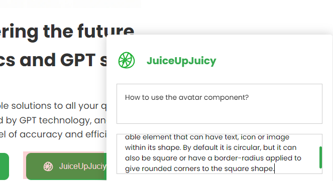

# aicoknow-demo

This is a simple Flask web application that allows semantic search of embeddings based on user input keywords. Additionally, users can add new documents to the knowledge repository.

## Setup
1. If you don't have Python installed, install it from [here](https://www.python.org/downloads/).

2. Clone this repository.

3. Navigate into the project directory.
    ```
    $ cd aicoknow-demo-master
    ```

4. Create a new virtual envrionment.
    ```
    $ python -m venv venv
    $ . venv/Scripts/activate
    ```

5. Install the requirements
    ```
    $ pip install -r requirements.txt
    ```

6. Add your own API key to the config.py file.

7. Run the app
    ```
    flask run
    ```

    You should be able to access the app at http://127.0.0.1:5000.
    
8. Type in your keyword and click the Search icon.


9. The browser immediately redirect itself to show the closest matches.


10.Click the JuiceUpJuicy button and add a new piece of knowledge in the box at the bottom right corner. 


All is done.
